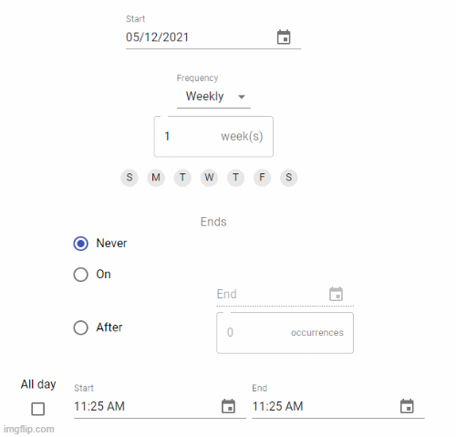

#  React Recurrence

[](https://www.npmjs.com/package/react-recurrence)   [](https://standardjs.com)

A simple, customizable, and reusable component for providing the recurrence functionality.

## Installation
The package can be installed via NPM:

```bash
npm install --save react-recurrence
```

## Demo
A live demo for the component can be found [here](https://ziadadeela.github.io/react-recurrence/).


## Usage
Below is a simple example on how to use the component. When any internal field is changed, **an updated recurrence object is emitted**.

Please note that **MuiPickersUtilsProvider** must be added at the root of your application with the appropriate date util.

```tsx
import {
  Recurrence,
  RecurrenceType,
  FrequencyType,
  EndingConditionType
} from 'react-recurrence'


const App = () => {

    const today = new Date()
    const defaultRecurrence = {
      startDate: today,
      endDate: today,
      frequency: FrequencyType.Weekly,
      numberOfRepetitions: 1,
      weekDaysRepetition: [],
      endingCondition: EndingConditionType.None,
      endingOccurrencesNumber: 0,
      isAllDay: false,
      startTime: today,
      endTime: today
      }

    const [recurrence, setRecurrence] = useState<RecurrenceType>(defaultRecurrence)

    const handleRecurrenceChange = (updatedRecurrence: RecurrenceType) => {
      setRecurrence(updatedRecurrence)
    }

    return (
      <MuiPickersUtilsProvider utils={DateFnsUtils}>
        <Recurrence
          recurrence={recurrence}
          onChange={handleRecurrenceChange}
        />
      </MuiPickersUtilsProvider>
    )
}
```
## Configuration
The component has a default structuring for the internal components. You can use it without passing the internal components as children as following:
```tsx
<Recurrence
  recurrence={recurrence}
  onChange={handleRecurrenceChange}
/>
```
Or you can structure and customise the internal components according to your needs as following:
```tsx
<Recurrence
  recurrence={recurrence}
  onChange={handleRecurrenceChange}
>
    <Grid
      container
      direction='column'
      justify='center'
      alignItems='center'
      spacing={3}
    >
      <Grid item xs={12}>
        <Recurrence.StartDateSelector/>
      </Grid>
      <Recurrence.FrequencySelector/>
      <Grid item sm={12}>
        <Recurrence.EndingConditionSelector/>
      </Grid>
      <Grid item sm={12}>
        <Recurrence.TimeSelector/>
      </Grid>
    </Grid>
</Recurrence>
```

## Props

### `recurrence (RecurrenceType)`

  ```
    startDate: Date
    frequency: FrequencyType
    numberOfRepetitions?: number
    weekDaysRepetition: Array<number>
    endingCondition: EndingConditionType
    endingOccurrencesNumber?: number
    endDate?: Date
    isAllDay: boolean
    startTime?: Date
    endTime?: Date
  ```

### `onChange (recurrence: RecurrenceType) ⇒ void`

  Any field changes within the component, will emit a recurrence object with the new change.


## Internal Components
you can find here the internal components that are used to structure the main recurrence component.




## RecurrenceType fields

### `startDate`

`Date`

Represents the start date of the recurrence.

### `frequency`

`[Enum] FrequencyType`

Represents how frequent the recurrence will be.

Enum values: `None`, `Hourly`, `Daily`, `Weekly`, `Monthly`, `Annually`

### `numberOfRepetitions`

`number<Nullable>`

Represents how many times the recurrence will be repeated according to the chosen frequency.


### `weekDaysRepetition`

`Array<number>`

Used when **weekly** repetition is chosen. Represents on which days the recurrence will happen in a week.

### `endingCondition`

`[Enum] EndingConditionType`

Represents what's the condition of ending a recurrence.

Enum values: `None`, `EndDate`, `OccurrencesNumber`


### `endingOccurrencesNumber`

`number<Nullable>`

Used when **OccurrencesNumber** ending condition is chosen. Represents how many times the recurrence will happen.


### `endDate`

`Date<Nullable>`

Used when **EndDate** ending condition is chosen. Represents the end date of the recurrence.


### `isAllDay`

`boolean`

Represents if a recurrence will be all day or if it has a start and end time


### `startTime`

`Date<Nullable>`

Used when **isAllDay** boolean is **false**. Represents the start time of the recurrence.


### `endTime`

`Date<Nullable>`

Used when **isAllDay** boolean is **false**. Represents the end time of the recurrence.


## To run Locally
- npm run start
- cd example -> npm run start

## To run tests
- npm run test

## Storybook
- npm run storybook


## License

MIT © [ziadadeela](https://github.com/ziadadeela)
